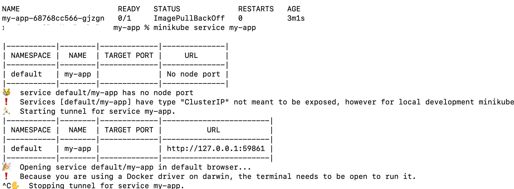

# My App

This project is a simple Flask-based application deployed to a local Kubernetes cluster using Minikube and Helm.

### Medium Article

For a detailed guide on this project, check out the [Medium article](https://medium.com/@ramchandra-vadranam/building-a-complete-ci-cd-pipeline-for-eks-with-aws-ecr-codepipeline-codebuild-and-helm-98ca37bc6b50) that explains the setup and deployment process.


## Prerequisites

Ensure you have the following tools installed:
- [Docker](https://docs.docker.com/get-docker/)
- [Minikube](https://minikube.sigs.k8s.io/docs/start/)
- [kubectl](https://kubernetes.io/docs/tasks/tools/)
- [Helm](https://helm.sh/docs/intro/install/)

## Project Structure

The project follows this structure:

```plaintext
my-app/
├── app/
│   ├── src/
│   │   └── app.py               # Application code
│   ├── tests/
│   └── requirements.txt         # Application dependencies
├── Dockerfile                   # Dockerfile to build the image
├── helm/
│   ├── values.yaml              # Helm values file for configuration
│   └── templates/
│       ├── deployment.yaml      # Kubernetes deployment configuration
│       └── service.yaml         # Kubernetes service configuration
└── infrastructure/              # (Optional) Infrastructure code
```
**`Setup Instructions`**

***1. Start Minikube***

Start Minikube with the Docker driver:

``` 
minikube start --driver=docker 
```

***2. Set Up Docker to Use Minikube's Environment***

Configure Docker to use Minikube's Docker daemon, allowing Minikube to access local Docker images:

```
eval $(minikube docker-env)
```

***3. Build the Docker Image***

Build and tag the Docker image for the application:

```
docker build -t local/my-app:latest .
```
***4. Configure Helm***

Make sure your `values.yaml` file in `helm/` is configured as follows:

```
# helm/values.yaml
image:
  repository: "local/my-app"   # Local image name
  tag: "latest"                # Image tag
  pullPolicy: "IfNotPresent"   # Use local image if available
```

***5. Deploy the Application Using Helm***

Install or upgrade the Helm release:

```
helm upgrade --install my-app ./helm --set image.repository=local/my-app --set image.tag=latest
```

***6. Expose the Application***

Since Minikube ClusterIP services aren't accessible outside the cluster by default, you can use either Minikube's tunnel feature or port-forwarding to access the application.

**Option 1: Use Minikube Service Tunnel**

This command will provide a URL for local access:
```
minikube service my-app
```
**Option 2: Use Port Forwarding**

Alternatively, forward the service to your local machine:

```
kubectl port-forward svc/my-app 8080:80
```

Access the application at `http://localhost:8080.`

**`Updating the Application`**

When making changes to the application, follow these steps to deploy the updates:

**1.Rebuild the Docker Image:**

```
docker build -t local/my-app:latest .
```
**2.Upgrade the Helm Release:**
```
helm upgrade --install my-app ./helm --set image.repository=local/my-app --set image.tag=latest
```
**3.Verify the Update: Check that the pods are running the latest version**
```
kubectl get pods
```
## Troubleshooting

**Common Issues**

**1.`ErrImagePull`: If Kubernetes shows `ErrImagePull`, ensure the image is available in Minikube’s Docker environment.**

Re-run the Docker build command after eval $(minikube docker-env).

**2.`Service Unreachable:` If the service is not reachable, make sure you are using Minikube’s tunnel or port-forwarding.**

**3.`View Pod Logs:` To debug any issues, check the logs of the application pod:**

```
kubectl logs <pod-name>
```
**4.Describe Pod for Details:**
```
kubectl describe pod <pod-name>
```





